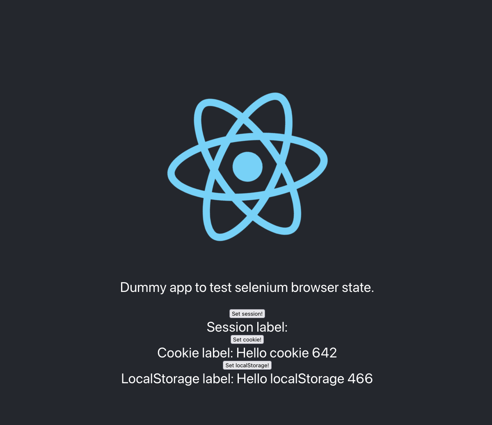

# Restore State to Selenium WebDriver Experiment

This project demonstrates restoring the state of a React website using Selenium WebDriver across multiple invocations. The state includes session storage, cookies, and localStorage.

## Restored Data

This experiment currently supports restoring the following types of data for a React website:

| Data Type                              | Restored | Notes                                                                  |
|----------------------------------------|----------|------------------------------------------------------------------------|
| **Session Storage**                    | ✅        | Data stored for the current browser session.                           |
| **Cookies**                            | ✅        | Includes HTTP and JavaScript-accessible cookies.                       |
| **LocalStorage**                       | ✅        | Persistent data stored in the browser.                                 |
| **Geo, Camera, Mic, etc. Permissions** | ❌        | Not yet implemented in this experiment, but feasible with additional setup. |
| **IndexedDB**                          | ❌        | Not yet implemented due to complexity and variations in data structure. |

The data is currently stored in an **S3 bucket**. A Lambda function retrieves it when needed, using **JSON format** for easy storage and manipulation. The storage adapter can be easily switched to other solutions like DynamoDB, Memcached, or Redis.

---

## React Website

The React website is a simple react init application with three buttons that write to:

- `sessionStorage`
- `document.cookie`
- `localStorage`

It is hosted on **S3** and served via **CloudFront**.




---

## Architecture Diagram

Below is a high-level architecture diagram illustrating the components and their interactions:

```
+--------------------+       +-------------------+       +---------------------+
|                    |       |                   |       |                     |
|   React Website    +<----->+   CloudFront CDN  +<----->+   S3 Bucket (Static |
|                    |       |                   |       |   Website Hosting)  |
|                    |       |                   |       |                     |
+--------------------+       +-------------------+       +---------------------+
        ^                                                       
        |                                                       
        |                                                       
        |                                                       
        v                                                       
+--------------------+       +-------------------+       +---------------------+
|                    |       |                   |       |                     |
|   Lambda Function  +<----->+   S3 Bucket       +<----->+   State Storage     |
|   (Selenium Runner)|       |   (State Data)    |       |   (JSON Format)     |
|                    |       |                   |       |                     |
+--------------------+       +-------------------+       +---------------------+
```

---

## CDK Deployment

This project uses **AWS CDK (in TypeScript)** for deployment and consists of two stacks:

### ReactSiteCdkStack

Deploys the static React website.

- **S3 Bucket**: Stores the React build artifacts.
- **CloudFront Distribution**: Serves the site.
- **Deployment Command**: Runs `npm run deploy` to build and upload contents of the `build/` directory.

### SeleniumRunnersCdkStack

Sets up a Lambda function to run **Selenium WebDriver** headlessly.

- **S3 Bucket**: Stores serialized browser state (session storage, cookies, localStorage).
- **Lambda Function**:
    - Uses a **docker image as runtime** that includes headless Chrome and WebDriver.
    - Captures browser state and uploads it to S3.
    - Accepts the following environment variables:
        - `URL`: The URL of the React website.
        - `S3_WEBDRIVER_DATA_BUCKET`: The bucket used for storing state.

---

## Prerequisites

- Node.js and npm installed.
- AWS CLI configured with valid credentials.
- AWS CDK installed globally:
  ```bash
  npm install -g aws-cdk
  ```

---

## Deployment Steps
1 Deploy the CDK stacks:
   ```bash
   npm run deploy
   ```

---

## Local Testing

You can test the Lambda function locally by setting up a `.env` file in the root of the project.

### Example `.env` file:
```dotenv
AWS_PROFILE=default
AWS_REGION=us-east-1
URL=https://d241m574llre88.cloudfront.net
S3_WEBDRIVER_DATA_BUCKET=seleniumrunnerscdkstack-seleniumrunnerscdkbucketc2-plnkitv3w858
```

Run the test locally with:
```bash
ts-node test/local-runner-webdriver-experiment.ts
```

---

## Cloud Testing

After deploying the stacks, you can invoke the Lambda function directly:

- Via **AWS Console** (under Lambda > Test)
- Or using AWS CLI:
  ```bash
  aws lambda invoke --function-name <YourFunctionName> output.json
  ```

---

## Validating Data Restore

Each invocation prints out a log of what data was restored or initialized:

### First Invocation (no state exists):

```json
[
  "Session did not exist, setting it now: Session label: Hello session 808",
  "Cookie did not exist, setting it now: Cookie label: Hello cookie 31",
  "LocalStorage did not exist, setting it now: LocalStorage label: Hello localStorage 248"
]
```

### Second Invocation (state restored):

```json
[
  "Session already exists: Session label: Hello session 808",
  "Cookie already exists: Cookie label: Hello cookie 31",
  "LocalStorage already exists: LocalStorage label: Hello localStorage 248"
]
```

## Alternative Approaches

### 1. Shared File System with Amazon EFS

One method for persisting Selenium WebDriver state is to use a **shared file system**, such as Amazon EFS, mounted to the Lambda function. This allows the browser's profile directory (which contains cookies, local storage, cache, etc.) to persist across Lambda invocations without needing to manually serialize or deserialize any data.

This approach can support more complex browser state, including **IndexedDB** and cached assets.

However, this was **not implemented** in this project due to the complexity of configuring Lambda inside a **VPC**, which is required to mount EFS. VPC-enabled Lambdas can lead to slower cold starts and require more intricate networking setups, which were out of scope for this experiment.

### 2. Remote WebDriver via Docker Container

Another option is to run **Chrome and WebDriver inside a persistent Docker container**, such as on an EC2 instance or an AWS Fargate task. The Lambda function can then connect to this container using **Selenium Remote WebDriver** over the network.

This setup keeps browser state within the container’s file system and removes the need to package and manage a browser inside the Lambda function.

While powerful, this introduces operational complexity:
- Managing long-lived containers (scaling, uptime, and patching)
- Exposing the WebDriver port securely (e.g., inside a private VPC)
- Health-checking and restarting the container if it fails

This architecture is best suited for scenarios where browser state is complex or test throughput exceeds Lambda’s constraints.

